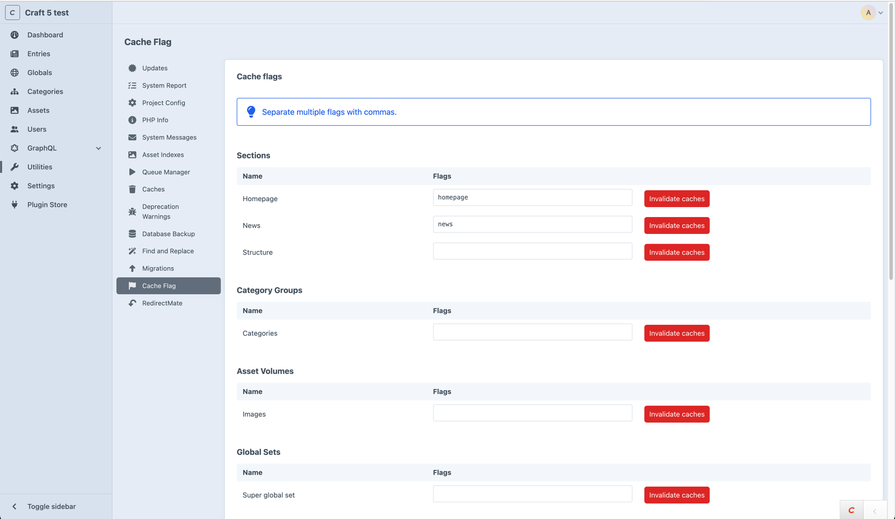

# Cache Flag plugin for Craft CMS

[](https://scrutinizer-ci.com/g/mmikkel/CacheFlag-Craft3/?branch=master)

Cache Flag is a Craft CMS plugin that adds an alternative cache invalidation strategy to template caches, using manually defined keywords ("flags").  

## Why does this plugin exist?  

Cache Flag was originally designed to circumvent common performance issues with the native `` tag's element query based invalidation strategy.  

Since Craft 3.5.0, said performance issues have been solved in core, making Cache Flag redundant for its primary use case. **If you were previously using Cache Flag only to avoid performance issues with ``, you probably don't need it anymore!**  

However, Cache Flag is still a valid alternative to the native `` tag if you want to  

* Implement automatic or manual bulk template cache invalidation (optionally, in combination with Craft's native element-based cache invalidation)  
* Cache arbitrary HTML output and implement your own invalidation strategies for it  
* Have completely cold template caches (like the [Cold Cache plugin](https://github.com/pixelandtonic/ColdCache), which is not available for Craft 5)  

## Table of contents  

* [Requirements](#requirements)  
* [Using Cache Flag](#using-cache-flag)  
* [Dynamic flags](#dynamic-flags)  
* [Arbitrary flags](#arbitrary-flags)  
* [Collecting element tags for automatic cache invalidation](#collecting-element-tags-for-automatic-cache-invalidation)  
* [Cold caches](#cold-caches)  
* [Invalidating flagged caches](#invalidating-flagged-caches)
* [Additional parameters](#additional-parameters)
* [Project Config](#project-config)
* [Events](#events)  

## Requirements

**This plugin requires Craft CMS 5.0+**  

## Using Cache Flag  

Cache Flag adds a new `` Twig tag to Craft CMS, which works just like the native `` tag - except that by default, Cache Flag's template caches are "cold" (i.e. _Cache Flag will not save element queries for automatic cache invalidation_).  

For cache invalidation, Cache Flag adds the ability to "flag" template caches and content with keywords ("flags"). Whenever an element is saved, moved or deleted, Cache Flag will automatically invalidate any flagged template caches matching that element's flags.  

_Here's how it looks in action:_  

```twig

    
    ...

```

**Note that multiple flags are separated using the pipe delimiter (`|`).**  

**Tip:** In addition to the `flagged` parameter it's also possible to have Cache Flag clear caches automatically in the same way the native `` tag does, using the new [`with elements`](#collecting-element-tags-for-automatic-cache-invalidation) directive.  

### I'm going to need an example.  

Sure. Let's assume you have a section called "News", and there's a cache that you want to invalidate whenever the content in that section changes (i.e. if entries are saved, deleted, changes status etc). First, you add the flag `news` (or whatever, the flags can be anything, really) to the "News" section in Cache Flag's CP utility: 



Then, you add that same `news` flag to any relevant caches, using the `` tag and the `flagged` parameter:  

```twig

    
    ...

```

Now, whenever an entry in the "News" section is saved, moved, deleted or changes status, any caches flagged with `news` will be automatically invalidated.      

## Dynamic flags

It's possible to flag caches using dynamic flags based on element IDs and/or UIDs. If you wanted to ensure that a cache is invalidated whenever a particular element is edited, moved or deleted, you can do this:  

```twig

    ...

```  

or if you prefer:  

```twig

    ...

```  

All native element types can be used in dynamic flags:  

`entry:#{entry.id}`  
`asset:#{asset.id}`  
`category:#{category.id}`  
`tag:#{tag.id}`  
`globalSet:#{globalSet.id}`  
`user:#{user.id}`  

It's also possible to use the `element` prefix, which works for all element types (including custom/third party ones):  

`element:#{element.id}`  
`element:#{element.uid}`  

Of course, it's possible to combine both standard and dynamic cache flags for a single cache:  

```twig

    ...

```

## Arbitrary flags  

The flags you add to your `` caches can be literally anything - and they don't have to be added to an element source (or be dynamic).    

A good use case for _arbitrary flags_ is when you've got a cache that don't involve any elements, for example if you wanted to cache output dependent on an external API call or something else that is time-consuming to parse on every request, e.g. something like this:  

```twig

    
    ...

```

If you use arbitrary flags, keep in mind that there's nothing that will actually invalidate those caches automatically (they'll essentially be _cold_ caches, albeit flagged). Read up on [the different options available for invalidating these - and other - flagged caches here](#invalidating-flagged-caches).  

## Collecting element tags for automatic cache invalidation

Since Cache Flag 1.1.0 (Craft 3.5.0-RC1 or later), it's possible to collect element tags (in addition to your own flags) for automatic cache invalidation just like the native `` tag does.  

If you want Cache Flag to collect element tags for automatic cache invalidation, you can add the `with elements` directive like this:  

```twig

    ...

```

Note: It's also possible to omit the `flagged` parameter and only use `with elements`, but at that point the `` tag would work identically to the native `` tag, and you should probably just use the latter.  

## Cold caches  

If both `flagged` and `with elements` are omitted from a `` tag, that cache will be completely "cold", and it will only be invalidated if/when it expires, or if a user manually invalidates it (or clears the entire data cache) via the Control Panel or the Craft CLI (see also _[invalidating flagged caches](#invalidating-flagged-caches)_):  

```twig

    ...

```

**Tip:** If you're upgrading a Craft 2 site that uses the [Cold Cache plugin](https://straightupcraft.com/craft-plugins/cold-cache), this is one way to achive the same thing on Craft 3.  

## Invalidating flagged caches

Cache Flag will automatically invalidate any caches with flags saved to one or multiple element sources defined in Cache Flag's CP utility, and caches using [dynamic flags](#dynamic-flags). These caches are invalidated whenever relevant elements are saved, deleted, moved or changes status.  

Cold caches and caches using [arbitrary flags](#arbitrary-flags) must be invalidated manually or programmatically (see below).  

### Manual cache invalidation

Flagged template caches can be manually invalidated by  

* Using the native Clear Caches utility in the Craft CP (check out the [CP Clear Cache plugin](https://plugins.craftcms.com/cp-clearcache) for easier access to this tool)  
* Clicking the "Invalidate all flagged caches" button in Cache Flag's CP utility    
* Using the native CLI command `invalidate-tags/cacheflag`  
* Using the native CLI command `invalidate-tags/template` (invalidates all template caches, including flagged ones)  
* Using the native CLI command `invalidate-tags/all` (invalidates all caches, including template caches)  

Additionally, Cache Flag exposes its own `cache-flag/caches/invalidate` CLI command, that can be used if you want to clear flagged template caches for specific flags (this also works with [arbitrary flags](#arbitrary-flags)):  

    ./craft cache-flag/caches/invalidate news,images,awesome
    
If you want to clear flagged caches over HTTP there's also a web controller action `cache-flag/caches/invalidate` which can be hit with a GET or POST request. This controller action will invalidate all flagged template caches, unless a parameter `flags` (string[]; array of flags) is present in the request.  

Finally, flushing the data cache will *delete* all template caches, including flagged ones.  

### Programmatic cache invalidation  

```php

use mmikkel\cacheflag\CacheFlag;

// Invalidate all flagged caches
CacheFlag::getInstance()->cacheFlag->invalidateAllFlaggedCaches();

// Invalidate caches for a particular element
CacheFlag::getInstance()->cacheFlag->invalidateFlaggedCachesByElement($entry);

// Invalidate caches for one or several flags
CacheFlag::getInstance()->cacheFlag->invalidateFlaggedCachesByFlags(['news', 'images']);

```

## Additional parameters

Beyond the `flagged` and `with elements` parameters, the `` tag _supports all the same parameters_ as [the native `` tag[(https://docs.craftcms.com/v3/dev/tags/cache.html#app)].  

## Project Config and `allowAdminChanges`

Cache Flag supports [Project Config](https://docs.craftcms.com/v3/project-config.html) since v. 1.2.0 (Craft 3.5.0 or later only). **If you're upgrading from an earlier version of Cache Flag, the relevant `.yaml` files will be automatically created after upgrading and running migrations.**  

## Events

Cache Flag dispatches two events:

* `beforeInvalidateFlaggedCaches`  
_Dispatched just before Cache Flag invalidates one or several flagged template caches._  

* `afterInvalidateFlaggedCaches`  
_Dispatched immediately after Cache Flag has invalidated one or several flagged template caches._  

Both events include a parameter `flags`, which is an array of the flags Cache Flag is invalidating caches for.    

### Listening to Cache Flag events

```php
use mmikkel\cacheflag\events\FlaggedTemplateCachesEvent;
use mmikkel\cacheflag\services\CacheFlagService;
use yii\base\Event;

Event::on(
    CacheFlagService::class,
    CacheFlagService::EVENT_BEFORE_INVALIDATE_FLAGGED_CACHES,
    function (FlaggedTemplateCachesEvent $event) {
        $flags = $event->flags;
        ...
    }
);

Event::on(
    CacheFlagService::class,
    CacheFlagService::EVENT_AFTER_INVALIDATE_FLAGGED_CACHES,
    function (FlaggedTemplateCachesEvent $event) {
        $flags = $event->flags;
        ...
    }
);
```

Note: Before Cache Flag 1.1.0, the `EVENT_AFTER_DELETE_FLAGGED_CACHES` (now deprecated in favor of `EVENT_AFTER_INVALIDATE_FLAGGED_CACHES`) would only be dispatched if caches were actually deleted. In Cache Flag 1.1.0+, the `EVENT_AFTER_INVALIDATE_FLAGGED_CACHES` event is dispatched regardless of whether any caches were actually cleared.  
